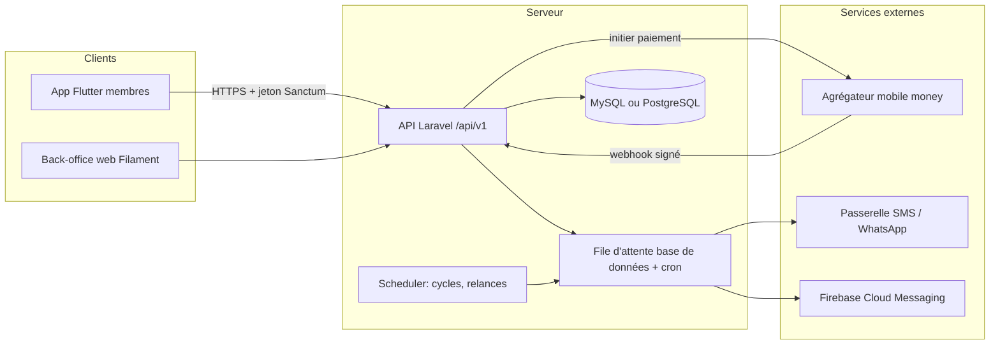

# Tontine BF / Lôgô BF : guide pour passer en SaaS

Document rédigé après lecture complète du dépôt `jino67/tontine-bf` (50 fichiers Dart, environ 10 000 lignes).
Il contient : l'état des lieux réel du code, les points bloquants, le modèle SaaS recommandé, l'architecture cible, l'organisation Git, la roadmap et un backlog prêt à transformer en issues GitHub.

---

## 0. En bref

- Le dépôt ne contient **que l'app Flutter**. Le backend est un ensemble de scripts PHP hébergés sur `poupecosmetic.com/api/` (Hostinger). Il n'est ni versionné ni présent sur le disque local.
- L'app compile (`flutter analyze` : 0 erreur, 9 warnings, 172 infos), mais environ la moitié des écrans sont des maquettes avec données en dur.
- **4 points empêchent toute mise en production**, SaaS ou non :
  1. aucune authentification côté serveur (n'importe qui peut agir au nom de n'importe quel `user_id`, y compris retirer de l'argent) ;
  2. un « tirage hybride » qui permet à l'admin de choisir discrètement les gagnants tout en affichant un tirage aléatoire ;
  3. des cagnottes à tickets payants avec tirage au sort, juridiquement assimilables à une loterie ;
  4. un portefeuille qui détient l'argent des utilisateurs, activité soumise à agrément dans l'UEMOA.
- Recommandation : **SaaS multi-organisations** (associations, groupements, coopératives, comités d'entreprise, IMF) avec un back-office web, l'app mobile pour les membres, un plan gratuit pour les petits groupes, et **aucune détention de fonds au lancement**.
- Stack cible : **Laravel (API + Filament) + MySQL/PostgreSQL + Redis**, app **Flutter refondue** (Riverpod, Dio, go_router), paiements via un **agrégateur mobile money agréé**.
- Durée estimée en solo : **14 à 18 semaines** jusqu'au pilote payant.

---

## 1. État des lieux du dépôt

### 1.1 Stack réelle vs README

| Sujet | README | Réalité dans le code |
|---|---|---|
| Backend | API REST Laravel | Scripts PHP « à actions » (`POST {action: ...}`) sur le domaine d'un autre projet |
| Base | MySQL | Probable (non vérifiable, backend absent) |
| Auth | OAuth2 | Aucune. Le « token » est `token_<timestamp>` généré dans le téléphone et jamais envoyé |
| CI/CD | GitHub Actions | Aucun workflow dans le dépôt |
| Firebase | non mentionné | `firebase_core`, `firebase_auth`, `cloud_firestore` en dépendances mais jamais initialisés |

Autres incohérences : nom « Lôgô BF » (README) vs « Tontine BF » (app) vs `app_tontine_bf` (package), `applicationId = com.example.app_tontine_bf` (refusé par le Play Store), `publish_to: 'All_fams'` au lieu de `'none'`.

### 1.2 Carte des écrans

| Écran | Fichier | État |
|---|---|---|
| Connexion | `lib/screens/auth/login_screen.dart` | Branché. Après connexion, ouvre `DashboardScreen` au lieu de `MainNavigation` : la barre du bas et le bouton admin n'apparaissent qu'après redémarrage |
| Inscription | `lib/screens/auth/register_screen.dart` | Branché |
| Mot de passe oublié | `login_screen.dart` | Ouvre WhatsApp vers `+22670000000` (numéro factice) |
| Accueil | `lib/screens/home/dashboard_screen.dart` | Stats et tontines branchées. Bloc « Cagnottes en cours » écrit en dur |
| Navigation | `lib/screens/home/main_navigation.dart` | Bouton « + » : les 3 actions ne font rien |
| Créer une tontine | `lib/screens/tontine/create_tontine_advanced_screen.dart` | Branché (invitation par recherche de numéro). Pas de date de début |
| Créer une tontine (v1) | `lib/screens/tontine/create_tontine_screen.dart` | Code mort, jamais ouvert |
| Détail tontine | `lib/screens/tontine/tontine_detail_screen.dart` | Branché (participants, partage du code par WhatsApp) |
| Rejoindre avec un code | absent | `TontineService.joinTontine()` existe mais aucun écran ne l'appelle |
| Portefeuille | `lib/screens/wallet/wallet_screen.dart` | Branché (« simulation Orange Money ») |
| Liste des cagnottes | `lib/features/cagnotte/screens/cagnotte_list_screen.dart` | Branché, **mais** ouvre une classe `CagnotteDetailScreen` factice déclarée en bas du même fichier |
| Détail cagnotte, participation | `cagnotte_detail_screen.dart`, `participation_screen.dart` | Branchés mais **inatteignables** à cause du point précédent |
| Résultats | `resultats_screen.dart` | Données simulées, inatteignable |
| Admin cagnottes | `admin/admin_cagnotte_manage.dart` | Données simulées, boutons qui affichent un SnackBar |
| Config tirage hybride | `admin/admin_tirage_config.dart` | Branché, `admin_id = "admin_123"` en dur |
| Forum, Messages, Chat | `lib/screens/community/*` | Maquettes (le chat simule une réponse automatique) |
| Épargne personnelle | `lib/screens/savings/savings_screen.dart` | Maquette (objectifs datés 2024), inatteignable |

Code jamais utilisé : `GroupeService`, `NotificationService`, `InvitationService`, `ApiService`, `TicketCounter`, `DashboardStats`, `TirageConfig`.

### 1.3 Contrat d'API implicite (31 actions)

Toutes les requêtes sont des `POST` JSON sans en-tête d'authentification, avec `user_id` dans le corps.

| Script | Actions |
|---|---|
| `auth_api.php` | `login`, `register`, `reset_password`, `get_user_info` |
| `tontine_api.php` | `create_tontine`, `join_tontine`, `get_system_tontines`, `get_participants`, `generate_invitation`, `search_users`, `get_user_tontines` |
| `wallet_api.php` | `get_wallet`, `deposit`, `withdraw`, `get_transactions` |
| `dashboard_api.php` | `get_dashboard_stats` (+ `test_api.php` en GET) |
| `cagnotte_api.php` | `get_cagnottes`, `get_cagnotte_detail`, `participer_cagnotte`, `get_mes_participations` |
| `groupe_api.php` | `get_groupes_utilisateur`, `get_messages_groupe`, `envoyer_message`, `rejoindre_groupe` |
| `notification_api.php` | `get_notifications`, `marquer_comme_lue`, `marquer_toutes_lues`, `supprimer_notification` |
| `tirage_api.php` | `configurer_tirage_hybride`, `demarrer_tirage_hybride`, `get_gagnants` |

Cette liste sert de base pour récupérer le code PHP et le schéma MySQL chez Hostinger avant de tout réécrire.

### 1.4 Bugs et fragilités notables

- `AuthService.baseUrl` se termine déjà par `auth_api.php` puis ajoute `/auth_api.php` : l'URL appelée est `.../auth_api.php/auth_api.php` et ne fonctionne que grâce au `PATH_INFO` d'Apache.
- L'URL du serveur est recopiée dans 9 fichiers.
- Rôle admin = champ `is_verified` lu dans le stockage local du téléphone.
- Désérialisation fragile : `Wallet.fromJson` attend `id` en `String` et `balance` en `num`, `Cagnotte.fromJson` attend `id` en `int`. Un type différent renvoyé par PHP fait planter l'écran.
- Montants en `double` alors que le franc CFA n'a pas de décimales (utiliser des entiers).
- « Chances approximatives » affichées au joueur avec une formule inventée (`tickets / (participants * 2)`).
- Prochain paiement calculé à partir d'aujourd'hui, pas de la date de début de la tontine.
- Liens d'invitation en `tontinebf.page.link` : Firebase Dynamic Links a été arrêté en août 2025, ces liens ne peuvent plus fonctionner.
- Nombreux `print` qui journalisent les données utilisateur complètes.

---

## 2. Points bloquants à traiter avant tout

### 2.1 Aucune authentification serveur (critique)

Le téléphone n'envoie aucun jeton, aucun cookie. Le serveur ne peut donc se fier qu'au `user_id` présent dans le corps. Conséquence : avec un simple `curl`, n'importe qui peut lire le portefeuille, retirer de l'argent ou créer des tontines au nom de n'importe quel utilisateur, et `search_users` permet d'aspirer l'annuaire des numéros.

**À faire :** authentification par OTP SMS + jeton Laravel Sanctum, identité toujours déduite du jeton côté serveur, politiques d'autorisation par ressource, limitation de débit.

### 2.2 Le « tirage hybride » discret est remplacé par une attribution publique

`admin_tirage_config.dart` et `tirage_service.dart` décrivaient une « sélection admin discrète » qui fixait les gagnants de certains rangs, avec une « raison interne », pendant que les utilisateurs voyaient un « affichage aléatoire ». Tromper des participants qui ont payé fait perdre leur confiance dès que c'est découvert, et aucun partenaire de paiement ne l'accepte.

**Décision retenue :** le responsable garde la possibilité d'imposer un gagnant ou un tour, mais **à découvert** :

- tontine `tirage_ordre` : les tours attribués sont publiés à tous les membres au lancement du tirage, avec l'empreinte, et ne changent plus ;
- cagnotte à gagnants : les rangs attribués sont affichés à tous, avec le nom, avant la première participation, puis verrouillés ;
- tout le reste est tiré au sort de façon vérifiable (voir 4.5), et l'application indique pour chaque résultat « attribué par le responsable » ou « tiré au sort ».

### 2.3 Cagnottes à tickets

Payer pour obtenir des tickets et gagner une part de la somme par tirage au sort relève d'un secteur réglementé dans beaucoup de pays. Le porteur du projet a choisi de **garder le module** et de l'améliorer ; le cadre applicable est à vérifier pays par pays avant l'ouverture au public.

Améliorations apportées par rapport à l'ancienne version : durée limitée avec compte à rebours, prix du ticket et répartition des gains affichés dès la création, commission de l'organisation plafonnée à 30 % et visible de tous, rangs attribués publics, tirage vérifiable, remise de chaque gain enregistrée puis confirmée par le gagnant, montants en entiers.

La **cagnotte solidaire** (collecte pour une personne, sans tirage) existe à côté, avec remise des fonds confirmée par le bénéficiaire.

### 2.4 Le portefeuille détient de l'argent

Un solde utilisateur alimenté par dépôt et vidé par retrait correspond à de la monnaie électronique ou à un service de paiement. Dans l'UEMOA, ces activités demandent un agrément BCEAO ou un partenaire agréé.

**À faire :** lancer sans détenir de fonds (voir 4.7, niveaux 1 et 2).

### 2.5 Backend hors dépôt et sur un domaine tiers

Le serveur tourne dans un sous-dossier de `poupecosmetic.com`, sur un hébergement mutualisé, sans versionnement. Un incident sur l'un des deux projets touche l'autre, et il n'existe aucune trace des évolutions.

**À faire :** récupérer le code PHP et un dump MySQL tout de suite (FTP ou gestionnaire de fichiers Hostinger), les archiver dans un dossier `legacy/` privé, puis héberger le SaaS sur son propre domaine.

### 2.6 Données personnelles

Numéros de téléphone visibles de tous les participants et des gagnants, recherche d'utilisateurs ouverte, logs verbeux. Le Burkina Faso encadre les traitements de données personnelles (loi n°001-2021/AN, contrôle de la CIL). À valider avec un juriste : déclaration du traitement, politique de confidentialité, consentement, durée de conservation, masquage des numéros.

---

## 3. Positionnement SaaS recommandé

### 3.1 Le modèle

Aujourd'hui l'app est une plateforme grand public unique. Pour en faire un SaaS rentable, on vend **un outil de gestion aux organisateurs**, pas un jeu aux particuliers.

- **Client payant (tenant)** : une organisation. Association, groupement de femmes, coopérative, comité d'entreprise, paroisse, mutuelle, IMF qui gère des groupes d'épargne.
- **Utilisateurs** : les responsables (présidente, trésorier) sur un back-office web, les membres sur l'app mobile.
- **Porte d'entrée gratuite** : n'importe quel particulier peut créer un petit groupe sans payer. Quand le groupe grossit ou veut les relances SMS, il passe au plan payant.

Proposition de valeur : fini le cahier du trésorier. Calendrier des cotisations, qui a payé, qui est en retard, relances automatiques, reçus, historique transparent et vérifiable par tous les membres.

### 3.2 Offre et tarification (hypothèses à valider avec 10 à 15 organisations)

| Plan | Prix indicatif | Contenu |
|---|---|---|
| Gratuit | 0 FCFA | 1 groupe actif, 15 membres, saisie manuelle des cotisations, notifications push |
| Groupe | 3 000 à 5 000 FCFA / mois | 5 groupes, 100 membres, relances SMS (quota), exports PDF et Excel, reçus |
| Organisation | 15 000 à 30 000 FCFA / mois | Groupes illimités, plusieurs admins et rôles, tableau de bord consolidé, collecte mobile money, support prioritaire |
| Institution | sur devis | Marque blanche, API, SSO, hébergement dédié, accompagnement |

Revenus complémentaires possibles : frais de service sur les cotisations payées via l'app (à caler sur les frais de l'agrégateur), packs SMS supplémentaires.

### 3.3 Garder, retirer, ajouter

| Garder et fiabiliser | Retirer | Ajouter |
|---|---|---|
| Tontine tour de rôle | Sélection admin discrète (remplacée par l'attribution publique) | Organisations, rôles, invitations |
| Tontine avec ordre tiré au sort entre membres | Portefeuille avec solde | Cycles, échéancier, retards, pénalités |
| Épargne de groupe avec objectif | Forum et chat maquettés (reporter) | Enregistrement des cotisations et reçus |
| Cagnotte solidaire et cagnotte à gagnants, à durée limitée | | Relances SMS, WhatsApp, push |
| Épargne personnelle (après branchement) | Firebase Auth et Firestore | Back-office web, exports, audit |
| Charte graphique verte et or | `create_tontine_screen.dart` v1 | Abonnements et facturation |

---

## 4. Architecture cible

### 4.1 Vue d'ensemble



### 4.2 Backend

- **Laravel 12 ou plus récent**, PHP 8.3+. Choix cohérent avec le README et avec l'expérience Laravel existante.
- `laravel/sanctum` : jetons pour l'app mobile.
- `filament/filament` : back-office avec multi-tenant intégré (un panel « organisation », un panel « super admin »).
- `spatie/laravel-permission` avec les « teams » : rôles par organisation.
- `spatie/laravel-activitylog` : journal d'audit.
- Files d'attente (SMS, notifications, webhooks) : pilote `database` traité par cron sur l'hébergement LWS, `laravel/horizon` et Redis une fois sur VPS.
- `dedoc/scramble` : documentation OpenAPI générée automatiquement.
- `pestphp/pest` : tests.

### 4.3 Multi-tenant

Une seule base, une colonne `organization_id` sur toutes les tables métier, un scope global appliqué automatiquement, et des tests qui vérifient qu'une organisation ne voit jamais les données d'une autre. C'est le modèle le plus simple à exploiter pour un démarrage. Une base par client ne se justifie que pour le plan Institution.

Un utilisateur est identifié par son numéro de téléphone et peut appartenir à plusieurs organisations.

### 4.4 Modèle de données

| Table | Colonnes clés |
|---|---|
| `organizations` | `name`, `slug`, `plan`, `subscription_status`, `currency` (XOF), `timezone` (Africa/Ouagadougou), `settings` json |
| `users` | `phone` (unique, format E.164), `name`, `email` nullable, `phone_verified_at`, `locale` |
| `organization_user` | `role` (owner, admin, tresorier, membre), `status` |
| `tontines` | `type` (rotative, tirage_ordre, epargne_groupe, epargne_perso), `name`, `amount` (entier FCFA), `frequency`, `starts_on`, `cycles_count`, `max_members`, `penalty_rules` json, `status`. Nommée `tontines` et non `groups`, mot réservé de MySQL 8 |
| `tontine_members` | `user_id`, `shares` (nombre de « mains »), `position` (ordre de passage), `status` |
| `invitations` | `code`, `token`, `expires_at`, `max_uses`, `used_count` |
| `cycles` | `number`, `due_on`, `beneficiary_member_id`, `status` (a_venir, en_cours, clos) |
| `contributions` | `cycle_id`, `member_id`, `amount_due`, `amount_paid`, `paid_at`, `method` (cash, orange_money, moov_money), `reference`, `proof_path`, `recorded_by`, `confirmed_by_member_at` |
| `payouts` | `cycle_id`, `member_id`, `amount`, `method`, `reference`, `status` |
| `penalties` | `contribution_id`, `amount`, `reason`, `waived_by` |
| `draws` | `tontine_id`, `seed_hash`, `seed` (révélé après), `slots` json (parts tirées), `designations` json (tours attribués), `result` json, `reveal_after`, `revealed_at` |
| `cagnottes` | `mode` (solidaire, gagnants), `duration`, `opens_at`, `ends_at`, `status`, `min_amount`, bénéficiaire (membre ou nom), remise des fonds ; pour le mode gagnants : `ticket_price`, `winners_count`, `prize_split` json, `fee_percent`, `designations` json, `draw_seed` chiffrée, `draw_seed_hash`, `draw_tickets` json |
| `cagnotte_contributions` | `user_id`, `amount`, `tickets`, `method`, `reference`, `recorded_by`, `confirmed_at` |
| `cagnotte_winners` | `rank`, `user_id`, `prize_amount`, `designated`, remise (`paid_at`, `paid_method`, `paid_reference`), `confirmed_at` |
| `payments` | `provider`, `provider_ref`, `idempotency_key`, `amount`, `status`, `payload` json |
| `ledger_entries` | `account`, `debit`, `credit`, `payable_type`, `payable_id` (écritures immuables) |
| `notifications` | table native Laravel |
| `activity_log` | journal d'audit (spatie) |
| `subscriptions`, `invoices` | plan, période, montant, statut, moyen de paiement |

Règles : montants en **entiers**, horodatages en UTC, aucune suppression physique des données financières (annulation par écriture inverse).

### 4.5 Tirage vérifiable, avec attributions publiques

1. Le responsable peut attribuer lui-même des tours (tontine) ou des rangs (cagnotte). Ces attributions sont publiées à tous avant que quiconque paie (cagnotte) ou au lancement du tirage (tontine), puis verrouillées.
2. Au lancement, le serveur génère une graine aléatoire (`random_bytes(32)`) et **publie son empreinte** `sha256(graine)` avec la liste figée de ce qui est tiré : parts `12#1` (tontine) ou tickets `u12#3` (cagnotte).
3. Après la date annoncée, n'importe quel membre révèle la graine.
   - Tontine : les parts sont triées par `sha256(graine + "|" + part)` puis placées dans les tours non attribués, du premier au dernier.
   - Cagnotte : les tickets des membres qui ont un rang attribué sont écartés, les autres sont triés par `sha256(graine + "|" + ticket)` ; chaque membre gagne au plus une fois, dans l'ordre de son premier ticket, pour les rangs non attribués.
4. Le téléphone de chaque membre recalcule le résultat et affiche « Tirage vérifié » ou « Vérification échouée ».

Une fois l'empreinte publiée, personne, admin compris, ne peut changer la partie tirée au sort, et c'est démontrable. Les choix du responsable ne sont jamais cachés.

### 4.6 API v1 (esquisse)

```
POST   /api/v1/auth/otp/request
POST   /api/v1/auth/otp/verify            -> jeton Sanctum
POST   /api/v1/auth/logout
GET    /api/v1/me

GET    /api/v1/orgs
POST   /api/v1/orgs
GET    /api/v1/orgs/{org}/members
POST   /api/v1/orgs/{org}/invitations

GET    /api/v1/orgs/{org}/groups
POST   /api/v1/orgs/{org}/groups
GET    /api/v1/groups/{group}
POST   /api/v1/groups/{group}/start
POST   /api/v1/groups/join                 {code}
GET    /api/v1/groups/{group}/cycles

POST   /api/v1/cycles/{cycle}/contributions        (saisie trésorier)
POST   /api/v1/contributions/{c}/confirm           (confirmation membre)
POST   /api/v1/contributions/{c}/pay               (paiement via agrégateur)
POST   /api/v1/cycles/{cycle}/payouts

POST   /api/v1/orgs/{org}/tontines/{t}/draw        (tours attribués + empreinte)
POST   /api/v1/orgs/{org}/tontines/{t}/draw/reveal
GET    /api/v1/orgs/{org}/tontines/{t}/draw        (données de vérification)

GET    /api/v1/orgs/{org}/cagnottes
POST   /api/v1/orgs/{org}/cagnottes                (mode solidaire ou gagnants)
PUT    /api/v1/orgs/{org}/cagnottes/{c}/designations
POST   /api/v1/orgs/{org}/cagnottes/{c}/draw       (tickets + empreinte)
POST   /api/v1/orgs/{org}/cagnottes/{c}/draw/reveal

GET    /api/v1/me/calendar
GET    /api/v1/me/contributions
GET    /api/v1/notifications

POST   /api/v1/webhooks/payments/{provider}        (signature vérifiée)
```

Réponses homogènes (`data`, `meta`, `errors`), codes HTTP standards, pagination, versionnement dans l'URL.

### 4.7 Paiements en 3 niveaux

| Niveau | Principe | Agrément | Quand |
|---|---|---|---|
| 1. Registre | Les membres paient en cash ou mobile money hors app. Le trésorier enregistre (référence, photo du reçu), le membre confirme dans l'app | Aucun | MVP et pilote |
| 2. Collecte directe | Paiement dans l'app via un agrégateur, **encaissé sur le compte marchand de l'organisation**. La plateforme ne touche pas les fonds, elle reçoit les webhooks et met à jour le registre | Porté par l'agrégateur et l'organisation | Après le pilote |
| 3. Reversements automatiques | Collecte puis reversement automatique au bénéficiaire du cycle | Partenaire agréé (banque, IMF, établissement de monnaie électronique) ou agrément propre | Seulement avec traction et conseil juridique |

Agrégateurs à comparer : CinetPay, PayDunya, Ligdicash. Critères : couverture Orange Money et Moov Money Burkina, frais, sous-comptes marchands, API de reversement, qualité des webhooks, délai de règlement.

Règles techniques : clé d'idempotence sur chaque paiement, vérification de signature des webhooks, job de réconciliation quotidien, statut toujours confirmé par le serveur (jamais par l'app).

### 4.8 Notifications

- OTP et relances : passerelle SMS locale ou agrégateur SMS (coût par SMS à intégrer dans les plans).
- WhatsApp Business : relances et reçus, très utilisé localement.
- Push : Firebase Cloud Messaging (garder Firebase uniquement pour ça).
- Calendrier : relance J-2, jour J, J+1 en retard, récapitulatif hebdomadaire au trésorier.
- Plus tard : canal USSD ou SMS pour les membres sans smartphone.

### 4.9 App Flutter refondue

```
apps/mobile/lib/
  app/            router (go_router), thème, configuration par environnement
  core/           client API (Dio + intercepteur jeton), stockage sécurisé, erreurs, format FCFA
  features/
    auth/         otp, session
    organizations/
    groups/       liste, création, détail, rejoindre (code et lien)
    cycles/       calendrier, détail d'un tour
    contributions/ saisie, confirmation, reçus
    draws/        tirage et vérification
    payments/
    notifications/
    profile/
      data/        dto (freezed + json_serializable), repositories
      presentation/ écrans, contrôleurs Riverpod
  l10n/           fr d'abord, mooré et dioula ensuite
```

Paquets : `dio`, `flutter_riverpod`, `go_router`, `freezed`, `json_serializable`, `flutter_secure_storage`, `intl`, `firebase_messaging`, `app_links` (liens profonds, remplace Dynamic Links), `sentry_flutter`.

Autres chantiers : une seule URL de base via `--dart-define`, flavors dev/staging/prod, `applicationId` définitif (ex. `bf.tontine.app`), remplacement de `withOpacity` par `withValues`, suppression des `print`, écrans vides et erreurs lisibles, mode hors ligne tolérant (cache des dernières données).

Ce qui se réutilise : le thème (`lib/config/theme.dart`), la mise en page des cartes, du dashboard, du détail tontine et du sélecteur de montant. La couche services et les modèles sont à réécrire.

### 4.10 Hébergement et exploitation

- Hébergement **LWS** : procédure complète dans [deploiement-lws.md](deploiement-lws.md).
- Au lancement, un hébergement web LWS suffit s'il offre PHP 8.2+, SSH, cron à la minute et MySQL/MariaDB. La file d'attente utilise la base de données et le cron remplace un worker permanent.
- Passage sur un VPS LWS (Nginx, PHP-FPM, Redis, Horizon, Supervisor) quand les volumes de SMS et de webhooks de paiement le justifient.
- Domaines : `domaine` (site vitrine), `app.domaine` (back-office), `api.domaine`.
- Environnement **staging** séparé de la production.
- Sauvegardes quotidiennes chiffrées hors serveur, test de restauration mensuel.
- Sentry (API et app), surveillance de disponibilité, alertes sur les webhooks en échec.

---

## 5. Organisation Git

### 5.1 Monorepo

Garder le dépôt actuel et le restructurer :

```
tontine-bf/
  apps/
    mobile/          app Flutter (contenu actuel de la racine)
    api/             Laravel + Filament
  docs/
    GUIDE_SAAS.md
    adr/             décisions d'architecture (1 fichier par décision)
    api/             export OpenAPI
  .github/
    workflows/
      mobile.yml
      api.yml
    ISSUE_TEMPLATE/
    pull_request_template.md
  README.md
```

### 5.2 Première restructuration

Marquer l'état actuel avant de toucher à quoi que ce soit :

```bash
git tag legacy-flutter-php && git push origin legacy-flutter-php
```

Déplacer l'app Flutter dans `apps/mobile` sur une branche dédiée :

```bash
git switch -c chore/monorepo
```

```bash
mkdir -p apps/mobile && git mv android ios lib linux macos web windows assets pubspec.yaml pubspec.lock analysis_options.yaml .metadata firebase.json .gitignore apps/mobile/
```

Créer l'API :

```bash
composer create-project laravel/laravel apps/api
```

Puis ajouter un `.gitignore` racine minimal (`.DS_Store`, `.idea/`, `.vscode/`), mettre à jour le README, committer et ouvrir une pull request.

### 5.3 Règles de travail

- `main` protégée : pas de push direct, merge par pull request après CI verte.
- Branches courtes : `feat/otp-auth`, `fix/cagnotte-navigation`, `chore/ci`.
- Messages au format Conventional Commits : `feat(api): ...`, `fix(mobile): ...`, `chore: ...`.
- Squash merge pour garder un historique lisible.
- Versions taguées `v0.1.0`, `v0.2.0`... avec GitHub Releases (APK joint pour les testeurs).
- Secrets uniquement dans GitHub Environments (`staging`, `production`), jamais dans le code. Le fichier `firebase_options.dart` actuel expose une clé web : la restreindre dans la console Google Cloud.
- Dépôt en **privé** dès que le code métier du SaaS y entre.

### 5.4 CI GitHub Actions

`.github/workflows/mobile.yml`

```yaml
name: mobile
on:
  pull_request:
    paths: ["apps/mobile/**"]
  push:
    branches: [main]
    paths: ["apps/mobile/**"]
jobs:
  check:
    runs-on: ubuntu-latest
    defaults:
      run:
        working-directory: apps/mobile
    steps:
      - uses: actions/checkout@v4
      - uses: subosito/flutter-action@v2
        with:
          channel: stable
          cache: true
      - run: flutter pub get
      - run: flutter analyze
      - run: flutter test
      - run: flutter build apk --release --dart-define=API_URL=${{ vars.API_URL }}
```

`.github/workflows/api.yml`

```yaml
name: api
on:
  pull_request:
    paths: ["apps/api/**"]
  push:
    branches: [main]
    paths: ["apps/api/**"]
jobs:
  test:
    runs-on: ubuntu-latest
    defaults:
      run:
        working-directory: apps/api
    steps:
      - uses: actions/checkout@v4
      - uses: shivammathur/setup-php@v2
        with:
          php-version: "8.3"
          coverage: none
      - run: composer install --no-interaction --prefer-dist
      - run: cp .env.example .env && php artisan key:generate
      - run: php artisan test
```

Le déploiement sur LWS se fait en SSH à partir d'une version taguée `v*` qui a passé la CI (voir [deploiement-lws.md](deploiement-lws.md)).

---

## 6. Roadmap

Estimations pour une personne à plein temps. Chaque phase se termine par une démo et un tag.

| Phase | Durée | Objectif | Terminé quand |
|---|---|---|---|
| 0. Cadrage et sauvetage | 1 sem. | Récupérer le backend PHP et la base, trancher les questions de la section 8, rendez-vous juriste, restructurer le dépôt | Code PHP et dump archivés, monorepo sur `main`, CI verte |
| 1. Socle API | 3 à 4 sem. | Laravel, OTP + Sanctum, organisations, rôles, groupes, membres, invitations, cycles, cotisations (saisie manuelle), audit, tests d'isolation entre organisations | Parcours complet d'une tontine rotative testé par Pest, doc OpenAPI publiée en staging |
| 2. Refonte mobile | 3 sem. | Nouvelle couche API, connexion OTP, groupes, rejoindre par code et lien, calendrier, confirmation des cotisations, suppression des maquettes et du code mort | Un membre suit sa tontine de bout en bout sur un vrai téléphone |
| 3. Back-office et relances | 2 sem. | Filament (organisation + super admin), exports PDF/Excel, reçus, relances SMS et push, tirage vérifiable | Un trésorier gère un groupe de 20 membres sans cahier |
| 4. Pilote gratuit | 3 à 4 sem. en parallèle | 3 à 5 organisations réelles, retours hebdomadaires, corrections | Au moins 2 organisations prêtes à payer |
| 5. Monétisation | 2 sem. | Plans et limites, abonnement payé par mobile money, factures, site vitrine, CGU et politique de confidentialité, publication Play Store | Premier abonnement encaissé |
| 6. Collecte mobile money | 2 à 3 sem. | Intégration agrégateur (niveau 2), webhooks, réconciliation, écritures comptables | Une cotisation payée dans l'app apparaît seule dans le registre |

Ensuite : iOS, marque blanche, langues nationales, USSD, épargne personnelle, messagerie de groupe, API pour les IMF.

---

## 7. Backlog prêt à créer en issues

### Milestone 0 : cadrage

- [ ] Télécharger les scripts PHP de `poupecosmetic.com/api/` et un dump MySQL, les archiver en privé
- [ ] Vérifier si la base contient de vrais utilisateurs et de vraies transactions
- [ ] Désactiver en production les actions `withdraw`, `deposit`, `configurer_tirage_hybride`, `demarrer_tirage_hybride`, `search_users`
- [ ] Rendez-vous juriste : loterie, monnaie électronique, données personnelles, CGU
- [ ] Choisir nom commercial et domaine
- [ ] Tag `legacy-flutter-php`, restructuration monorepo, CI mobile

### Milestone 1 : socle API

- [ ] Projet Laravel, Pest, Scramble, Horizon, configuration staging
- [ ] Auth OTP (demande, vérification, limitation de débit, expiration)
- [ ] Organisations, rôles, invitations
- [ ] Scope global `organization_id` + tests d'isolation
- [ ] Groupes (5 types), membres, parts, ordre de passage
- [ ] Génération des cycles selon fréquence et date de début
- [ ] Cotisations : saisie, confirmation, retards, pénalités
- [ ] Versements aux bénéficiaires
- [ ] Journal d'audit sur toutes les écritures financières
- [x] Tirage vérifiable (empreinte, révélation, recalcul), avec tours attribués publics
- [x] Cagnottes solidaires et à gagnants, durées flash, 7 jours, 30 jours ou libre

### Milestone 2 : mobile

- [ ] Flavors et `--dart-define API_URL`, `applicationId` définitif
- [ ] Client Dio + intercepteur jeton + stockage sécurisé
- [ ] Riverpod + go_router, suppression de `MainNavigation` actuel
- [ ] Écrans OTP, liste des organisations et groupes
- [ ] Rejoindre un groupe par code et par lien (`app_links`)
- [ ] Calendrier personnel des cotisations
- [ ] Détail d'un cycle, confirmation de paiement, reçu
- [x] Écran « Vérifier ce tirage » (tontines et cagnottes)
- [x] Onglet Cagnottes : compte à rebours, tickets, gains, tirage, remises
- [ ] Notifications push
- [ ] Supprimer : sélection admin discrète, portefeuille, forum/chat maquettés, `create_tontine_screen.dart`, dépendances Firebase inutiles

### Milestone 3 : back-office

- [ ] Panel Filament organisation (groupes, membres, cotisations, retards)
- [ ] Panel super admin (organisations, plans, support)
- [ ] Exports PDF et Excel, reçus PDF
- [ ] Relances SMS programmées
- [ ] Tableau de bord trésorier

### Milestone 5 : monétisation

- [ ] Plans et limites appliquées côté API
- [ ] Abonnement, période d'essai, période de grâce, factures
- [ ] Site vitrine, CGU, politique de confidentialité
- [ ] Fiche Play Store, politique de données Google Play

### Milestone 6 : paiements

- [x] Agrégateur retenu : PayDunya (paiements par facture, remises par déboursement)
- [x] Initiation de paiement, application unique du résultat relu chez PayDunya
- [x] Notifications signées (SHA-512 de la clé principale) pour paiements et remises
- [ ] Traitement des notifications en file d'attente
- [ ] Réconciliation quotidienne et alertes
- [ ] Écritures `ledger_entries`

---

## 8. Décisions à trancher

1. **Cible prioritaire** : organisations (recommandé) ou particuliers ?
2. **Cagnottes à tickets** : tranché, maintenues et améliorées, avec gagnants attribuables uniquement de façon publique.
3. **Niveau de paiement au lancement** : registre seul (recommandé) ou collecte directe ?
4. **Marque** : Lôgô BF ou Tontine BF, et nom de domaine.
5. **Données existantes** : y a-t-il de vrais utilisateurs à migrer ?
6. **Périmètre géographique** : Burkina Faso seul ou UEMOA (même devise, extension facile) ?
7. **Base de données** : MySQL (continuité) ou PostgreSQL ?

---

## Annexe : migration depuis le backend PHP

1. Récupérer le code et le schéma, lister les tables et leurs volumes.
2. Écrire une commande Artisan `legacy:import` idempotente qui lit l'ancienne base et remplit les nouvelles tables, en conservant un `legacy_id`.
3. Mots de passe : s'ils ont été stockés avec `password_hash()` (bcrypt), Laravel peut les vérifier tels quels. Sinon (md5, sha1, texte clair), ne pas les importer et basculer ces comptes sur l'OTP.
4. Normaliser les numéros au format `+226XXXXXXXX`, fusionner les doublons.
5. Ne pas importer les anciennes cagnottes ni les configurations de tirage discrètes (`tirage_config`). Conserver une archive hors ligne si des sommes réelles sont en jeu.
6. Informer les utilisateurs existants avant la bascule (SMS), avec la date de fin de l'ancienne app.
7. Couper les anciens scripts PHP une fois la migration vérifiée.
